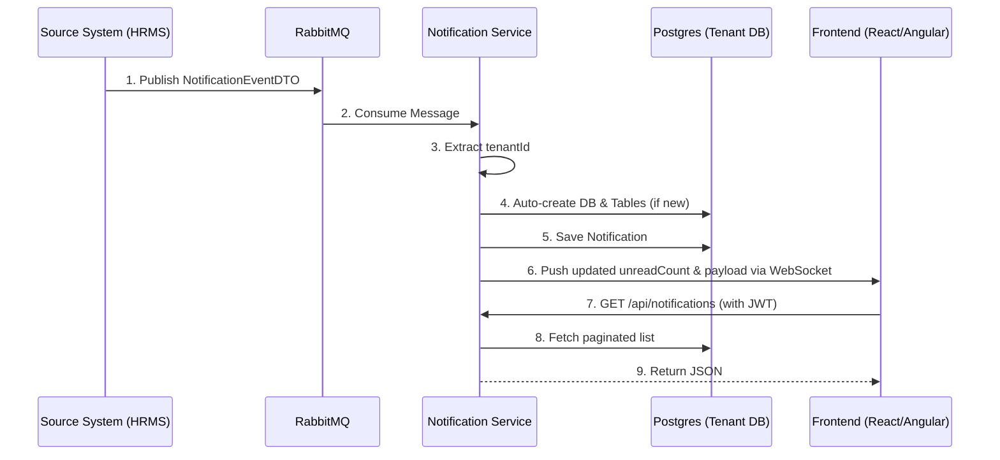

# Central Notification Service (CNS)

A high-performance, **multi-tenant real-time notification engine**. 
It ingests events from your backend microservices, dynamically provisions separate tenant databases on-the-fly, and pushes live updates to users via WebSockets.

## Architecture Flow

> [!TIP]
> **Zero Configuration:** If a notification arrives for a brand new `tenantId`, CNS automatically creates a new Postgres database and runs migrations in real-time. No manual setup required!
> 
> **Dead Letter Queue:** If a published message fails (e.g. missing `tenantId`), CNS retries 3 times and then safely parks it in the `notification.dlq` Dead Letter Queue for inspection. No data is lost.

## How to Use CNS (Developer Guide)

To integrate with the Central Notification Service, follow these steps depending on your platform:

### 1. Backend Developers (Publishing Notifications)
Whenever an event occurs in your microservice that requires a user notification, publish a message to the RabbitMQ queue configured for CNS.
- **Payload:** Send a `NotificationEventDTO`.
- **Tenant Context:** Ensure the message includes the `tenantId` so CNS can dynamically route it and provision the correct database.
- CNS will automatically consume, process, and persist the notification without any additional API calls.

### 2. External Service (Authentication)
To consume notifications securely via WebSocket or REST APIs, the frontend requires a valid JWT token.
- The external service must expose an API to generate a **CNS Ticket** (JWT token).
- This JWT token must be generated using the **CNS Secret Key**. 
- *Crucial:* The external service and CNS must share the exact same secret key to ensure successful authentication.

### 3. Frontend Developers (Consuming Notifications)
**Real-Time Updates (WebSocket):**
- Connect your React/Angular application to the CNS WebSocket endpoint.
- Listen for pushed messages to receive real-time updates containing the updated `unreadCount` and notification payload.

**Historical Data (REST API):**
- **Fetch Notifications:** `GET /api/notifications?userId={userId}&unreadOnly=false&page=0&size=20`
- **Mark Single as Read:** `PUT /api/notifications/{id}/read`
- **Mark All as Read:** `PUT /api/notifications/read-all?userId={userId}`
*(Note: Ensure your JWT token is included in the Authorization header for REST calls.)*
