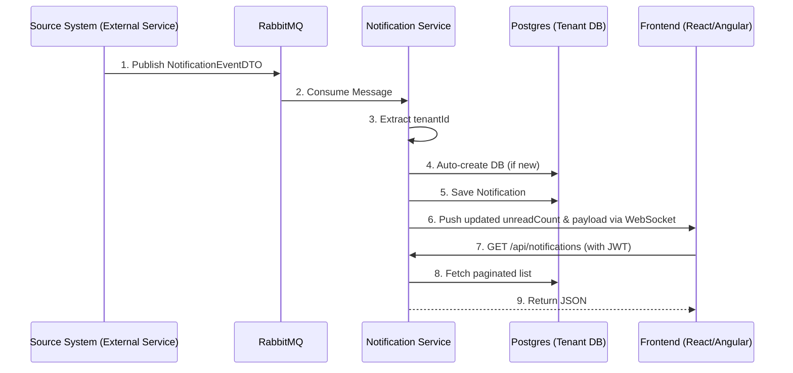

# Central Notification Service (CNS)

A high-performance, **multi-tenant real-time notification engine**.

## 🚀 Core Features

- **Zero Configuration Multitenancy:** If a notification arrives for a brand new `tenantId`, CNS automatically creates a new Postgres database and runs migrations in real-time. No manual setup required!
- **Real-Time WebSockets:** Instantly pushes `unreadCount` and notification payloads directly to the frontend.
- **Dead Letter Queue (DLQ) & Resilience:** If a published message fails (e.g., missing `tenantId`), CNS retries 3 times and then safely parks it in the `notification.dlq` for inspection. No data is lost.

---

## 🏗️ Architecture Flow



---

## 🛠️ Integration Guide (Developer Usage)

To use CNS in your microservices ecosystem, follow these integration steps:

### 1. External Service Authentication (CNS Ticket)

To consume notifications securely via WebSocket or REST APIs, the frontend requires a valid JWT token.
- The external service must expose an API to generate a **CNS Ticket** (JWT token).
- This JWT token must be generated using the **CNS Secret Key**. 
- *Crucial:* The external service and CNS must share the exact same secret key to ensure successful authentication.

#### Example: Generating a CNS Ticket (Java)
Here is a minimal example of how an external service can generate this ticket using the `jjwt` library:
```java
import io.jsonwebtoken.Jwts;
import io.jsonwebtoken.SignatureAlgorithm;
import java.util.Date;

public class CnsTicketGenerator {
    public String generateCnsTicket(String userId, String tenantId, String cnsSecretKey) {
        long expirationTime = 3600000; // 1 hour
        return Jwts.builder()
                .setSubject(userId)
                .claim("tenantId", tenantId)
                .setIssuedAt(new Date())
                .setExpiration(new Date(System.currentTimeMillis() + expirationTime))
                .signWith(SignatureAlgorithm.HS256, cnsSecretKey.getBytes())
                .compact();
    }
}
```

### 2. Backend Developers (Publishing Notifications)

Whenever an event occurs in your microservice that requires a user notification, publish a message to the RabbitMQ queue configured for CNS. CNS will automatically consume, process, and persist the notification without any additional API calls.

**Payload Structure:** Send a `NotificationEventDTO` (must be JSON serialized).

```json
{
  "tenantId": "acme-corp",
  "sourceSystem": "HRMS",
  "recipientUserIds": ["user-123", "user-456"],
  "message": "Your leave request has been approved.",
  "actionUrl": "https://hrms.acme.com/leave/789",
  "persistNotification": true
}
```

#### Example: Publishing via RabbitMQ (Spring Boot)

**1. application.properties**
Configure your application with the CNS exchange and your specific routing key (queue name). 
*(Note: Your queue name must match exactly what is defined in the CNS `rabbitmq.queues` configuration.)*
```properties
spring.rabbitmq.host=localhost
spring.rabbitmq.port=5672

cns.rabbitmq.exchange=notification.exchange
cns.rabbitmq.routing-key=YOUR_ASSIGNED_QUEUE_NAME
```

**2. Message Converter Configuration**
By default, Spring's `RabbitTemplate` uses standard Java serialization. Since CNS expects JSON, you must add a minimal configuration class to use the `Jackson2JsonMessageConverter`:

```java
import org.springframework.amqp.support.converter.Jackson2JsonMessageConverter;
import org.springframework.amqp.support.converter.MessageConverter;
import org.springframework.context.annotation.Bean;
import org.springframework.context.annotation.Configuration;

@Configuration
public class RabbitMQConfig {
    @Bean
    public MessageConverter jsonMessageConverter() {
        return new Jackson2JsonMessageConverter();
    }
}
```

**3. Publishing the Event**
Use Spring's `RabbitTemplate` to push the notification:

```java
import org.springframework.amqp.rabbit.core.RabbitTemplate;
import org.springframework.beans.factory.annotation.Value;
import org.springframework.stereotype.Service;

@Service
public class NotificationPublisher {
    private final RabbitTemplate rabbitTemplate;

    @Value("${cns.rabbitmq.exchange}")
    private String exchangeName;

    @Value("${cns.rabbitmq.routing-key}")
    private String routingKey;

    public NotificationPublisher(RabbitTemplate rabbitTemplate) {
        this.rabbitTemplate = rabbitTemplate;
    }

    public void sendNotification(NotificationEventDTO event) {
        // Publishes to the direct exchange using your specific queue name as the routing key
        rabbitTemplate.convertAndSend(exchangeName, routingKey, event);
    }
}
```

### 3. Frontend Developers (Consuming Notifications)

**Real-Time Updates (WebSocket):**
- Connect your React/Angular application to the CNS WebSocket endpoint.
- Listen for pushed messages to receive real-time updates containing the updated `unreadCount` and notification payload.

**Historical Data (REST API):**
*(Note: Ensure your CNS JWT ticket is included in the `Authorization` header for all REST calls.)*

- **Fetch Notifications:** `GET /api/notifications?userId={userId}&unreadOnly=false&page=0&size=20`
- **Mark Single as Read:** `PUT /api/notifications/{id}/read`
- **Mark All as Read:** `PUT /api/notifications/read-all?userId={userId}`
