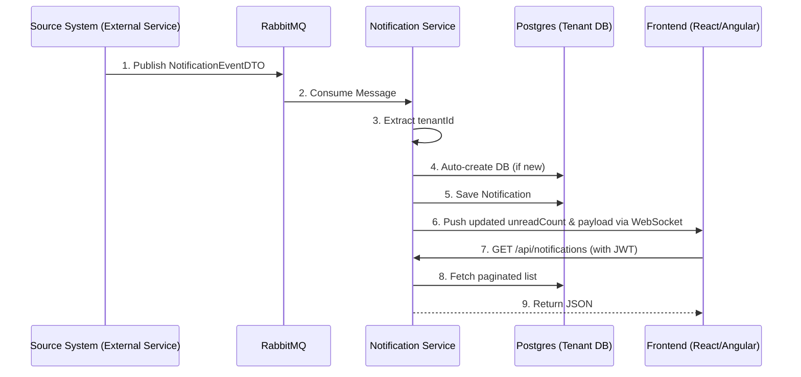

# Central Notification Service (CNS)

A high-performance, **multi-tenant real-time notification engine**.

## 🚀 Core Features

- **Zero Configuration Multitenancy:** If a notification arrives for a brand new `tenantId`, CNS automatically creates a new Postgres database and runs migrations in real-time. No manual setup required!
- **Self-Service Integration:** A new integration registers itself (`POST /api/admin/services`) instead of editing CNS config — its queue is provisioned and consumed at runtime, no redeploy.
- **Per-Service JWT Keys:** No shared secret — each integration verifies with its own registered public key, so rotating one service's signing key never touches any other service.
- **Always-Fresh Sender Info:** An optional per-service lookup URL lets CNS resolve a sender's current avatar/display name at read time, instead of freezing it at the moment the notification was created.
- **Real-Time WebSockets:** Instantly pushes `unreadCount` and notification payloads directly to the frontend.
- **Dead Letter Queue (DLQ) & Resilience:** If a published message fails (e.g., missing `tenantId`), CNS retries 3 times and then safely parks it in the `notification.dlq` for inspection. No data is lost.

---

## 🏗️ Architecture Flow



---

## 🛠️ Integration Guide (Developer Usage)

To use CNS in your microservices ecosystem, follow these integration steps:

### 1. External Service Authentication (CNS Ticket)

To consume notifications securely via WebSocket or REST APIs, the frontend requires a valid JWT token — a **CNS Ticket**. There is no shared secret: each service signs its own tokens with its own key pair, registered with CNS.

1. Generate an RSA key pair yourself (`openssl genrsa`, or any RSA keypair tool). Keep the private key entirely within your deployment — never send it anywhere, including to CNS.
2. Register the **public** key against your `(tenantId, sourceSystem)` pair (see step 2.0 below, or `PUT /api/admin/services/{tenantId}/{sourceSystem}/jwt-public-key` if you're updating one already registered). Registration is per tenant, not per source-system-in-general: if each of your customers runs their own separate instance of your service, each one registers — and rotates — its own key independently.
3. Sign your CNS Tickets yourself with RS256, and set the `iss` claim to your `sourceSystem` and the `tenantId` claim to that deployment's tenant id — together, that's how CNS knows which registered public key to verify the token with.

```java
import io.jsonwebtoken.Jwts;
import io.jsonwebtoken.SignatureAlgorithm;
import java.security.PrivateKey;
import java.util.Date;

public class CnsTicketGenerator {
    public String generateCnsTicket(String userId, String tenantId, String sourceSystem, PrivateKey yourPrivateKey) {
        long expirationTime = 3600000; // 1 hour
        return Jwts.builder()
                .setSubject(userId)
                .setIssuer(sourceSystem)          // must match the sourceSystem you registered
                .claim("tenantId", tenantId)
                .setIssuedAt(new Date())
                .setExpiration(new Date(System.currentTimeMillis() + expirationTime))
                .signWith(yourPrivateKey, SignatureAlgorithm.RS256)
                .compact();
    }
}
```

Rotating your key later is entirely your call — generate a new pair, `PUT` the new public key, done. No coordination with CNS, or with any other tenant's deployment of the same source system, required.

A token missing either the `iss` or `tenantId` claim, or naming a `(tenantId, sourceSystem)` pair with no public key registered, is rejected outright — register your public key first (step 2.0 below).

### 2. Backend Developers (Publishing Notifications)

#### 2.0. Register your service (one-time, self-service)

Register once **per tenant deployment** of your service, not once for the whole product — if you run a separate instance per customer, each instance registers independently, with its own key and its own user-lookup URL. This is a one-time call per tenant — no CNS config change or redeploy needed for a new integration, or for a new tenant onboarding onto an integration that already exists elsewhere:

```bash
curl -X POST https://cns.internal/api/admin/services \
  -H "X-Admin-Api-Key: <admin key, provided by the CNS team>" \
  -H "Content-Type: application/json" \
  -d '{
        "tenantId": "acme-corp",
        "sourceSystem": "hrms",
        "jwtPublicKey": "-----BEGIN PUBLIC KEY-----\n...\n-----END PUBLIC KEY-----",
        "userLookupUrl": "https://hrms.acme-corp.internal/api/users/lookup",
        "userLookupApiKey": "<a credential your own lookup endpoint checks>"
      }'
```

`tenantId` and `sourceSystem` together are the registration's identity — must exactly match the `tenantId`/`iss` claims on this deployment's JWTs and the `tenantId`/`sourceSystem` fields on its `NotificationEventDTO`s. Everything else is optional:
- `queueName` — defaults to `<tenantId>.<sourceSystem>.notification.queue`; this is the routing key you publish to below.
- `jwtPublicKey` — required before any user of this deployment can authenticate against CNS's REST/WebSocket API (see step 1 above). Omit it only if this deployment exclusively publishes notifications and never calls CNS's API directly.
- `userLookupUrl` — enables always-fresh avatars/display names for this tenant's users (see "Keeping avatars/display names fresh" below). Omit it to keep the send-time snapshot behavior.
- `userLookupApiKey` — if set, CNS sends it as the `X-Internal-Api-Key` header on every call to `userLookupUrl`, so your endpoint can require a credential instead of sitting open. Omit it only if your lookup endpoint is intentionally unauthenticated.

Update any of these later with `PUT /api/admin/services/{tenantId}/{sourceSystem}/jwt-public-key` or `PUT /api/admin/services/{tenantId}/{sourceSystem}/user-lookup-url`, or `DELETE /api/admin/services/{tenantId}/{sourceSystem}` to deactivate.

Whenever an event occurs in your microservice that requires a user notification, publish a message to your registered RabbitMQ queue. CNS will automatically consume, process, and persist the notification without any additional API calls.

**Payload Structure:** Send a `NotificationEventDTO` (must be JSON serialized).

```json
{
  "tenantId": "acme-corp",
  "sourceSystem": "HRMS",
  "recipientUserIds": ["user-123", "user-456"],
  "message": "Your leave request has been approved.",
  "actionUrl": "https://hrms.acme.com/leave/789",
  "persistNotification": true,
  "senderInfo": {
    "userId": "user-999",
    "displayName": "Jane Doe",
    "avatarUrl": "https://hrms.acme.com/avatars/user-999.png"
  }
}
```

`senderInfo` is a **snapshot at send time** — it's what a notification shows by default. It will go stale the moment that user changes their avatar/name (CNS has no way to know that on its own). If you want the notification list to always reflect the sender's *current* avatar/name instead, register a `userLookupUrl` — see below.

#### Keeping avatars/display names fresh (`userLookupUrl`)

If registered, CNS calls this URL at read time (`GET /api/notifications`) to resolve the current display info for the senders on that page, overlaying it over the stored `senderInfo` snapshot. Which URL gets called is resolved by the requesting user's own `(tenantId, sourceSystem)` — so each tenant's deployment is only ever asked about its own users. It's called with a short timeout (500ms connect / 800ms read) and any failure — timeout, non-2xx, malformed body — just falls back to the snapshot, so a slow or down endpoint never breaks or noticeably slows the notification list.

**Contract your endpoint must implement:**

Request — `POST {userLookupUrl}`, header `X-Internal-Api-Key: {userLookupApiKey}` if you registered one
```json
{ "userIds": ["user-123", "user-456"] }
```

Response — `200 OK`, a map keyed by the user id (omit ids you can't resolve rather than erroring):
```json
{
  "user-123": { "displayName": "Alice Smith", "avatarUrl": "https://hrms.acme.com/avatars/user-123.png" },
  "user-456": { "displayName": "Bob Lee",     "avatarUrl": "https://hrms.acme.com/avatars/user-456.png" }
}
```

This is entirely your service's job to implement — CNS never needs a new event type or a code change to support it, regardless of how your user directory is structured internally.

#### Example: Publishing via RabbitMQ (Spring Boot)

**1. application.properties**
Configure your application with the CNS exchange and the queue name you got back from registering in step 2.0.
```properties
spring.rabbitmq.host=localhost
spring.rabbitmq.port=5672

cns.rabbitmq.exchange=notification.exchange
cns.rabbitmq.routing-key=YOUR_ASSIGNED_QUEUE_NAME
```

**2. Message Converter Configuration**
By default, Spring's `RabbitTemplate` uses standard Java serialization. Since CNS expects JSON, you must add a minimal configuration class to use the `Jackson2JsonMessageConverter`:

```java
import org.springframework.amqp.support.converter.Jackson2JsonMessageConverter;
import org.springframework.amqp.support.converter.MessageConverter;
import org.springframework.context.annotation.Bean;
import org.springframework.context.annotation.Configuration;

@Configuration
public class RabbitMQConfig {
    @Bean
    public MessageConverter jsonMessageConverter() {
        return new Jackson2JsonMessageConverter();
    }
}
```

**3. Publishing the Event**
Use Spring's `RabbitTemplate` to push the notification:

```java
import org.springframework.amqp.rabbit.core.RabbitTemplate;
import org.springframework.beans.factory.annotation.Value;
import org.springframework.stereotype.Service;

@Service
public class NotificationPublisher {
    private final RabbitTemplate rabbitTemplate;

    @Value("${cns.rabbitmq.exchange}")
    private String exchangeName;

    @Value("${cns.rabbitmq.routing-key}")
    private String routingKey;

    public NotificationPublisher(RabbitTemplate rabbitTemplate) {
        this.rabbitTemplate = rabbitTemplate;
    }

    public void sendNotification(NotificationEventDTO event) {
        // Publishes to the direct exchange using your specific queue name as the routing key
        rabbitTemplate.convertAndSend(exchangeName, routingKey, event);
    }
}
```

### 3. Frontend Developers (Consuming Notifications)

**Real-Time Updates (WebSocket):**
- Connect your React/Angular application to the CNS WebSocket endpoint.
- Listen for pushed messages to receive real-time updates containing the updated `unreadCount` and notification payload.

**Historical Data (REST API):**
*(Note: Ensure your CNS JWT ticket is included in the `Authorization` header for all REST calls.)*

- **Fetch Notifications:** `GET /api/notifications?userId={userId}&unreadOnly=false&page=0&size=20`
- **Mark Single as Read:** `PUT /api/notifications/{id}/read`
- **Mark All as Read:** `PUT /api/notifications/read-all?userId={userId}`
- **Delete a Notification:** `DELETE /api/notifications/{id}` — unlike the endpoints above, this one takes no `userId` query param; the caller's id is taken from the JWT itself (the `sub` claim in the CNS Ticket), so a user can only ever delete their own notifications. Returns `404` if the notification doesn't exist, `403` if it belongs to a different user.
