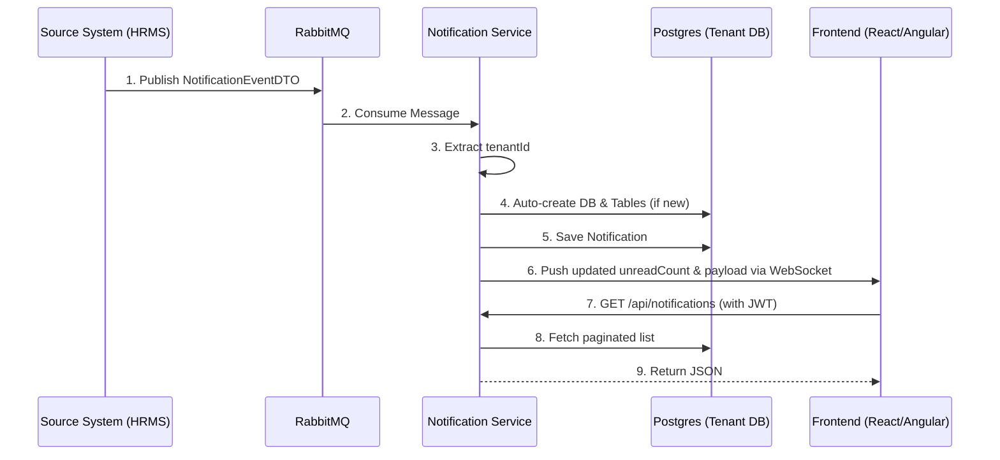

# Central Notification Service (CNS)

A high-performance, **multi-tenant real-time notification engine**. 
It ingests events from your backend microservices, dynamically provisions separate tenant databases on-the-fly, and pushes live updates to users via WebSockets.

## Architecture Flow

> [!TIP]
> **Zero Configuration:** If a notification arrives for a brand new `tenantId`, CNS automatically creates a new Postgres database and runs migrations in real-time. No manual setup required!
> 
> **Dead Letter Queue:** If a published message fails (e.g. missing `tenantId`), CNS retries 3 times and then safely parks it in the `notification.dlq` Dead Letter Queue for inspection. No data is lost.
